#  Earneuro

Earneuro is a modern personal finance platform designed to help users take control of their income and spending. From salary management and budgeting to savings goals and financial analytics, Earneuro provides everything needed to build healthier financial habits.

##  Features

###  Salary Management
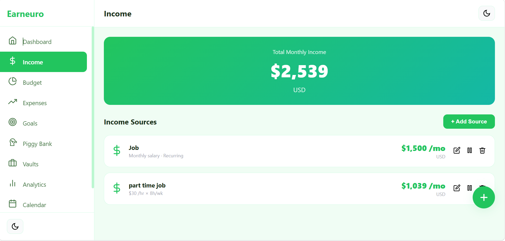
- Add monthly salary or hourly income
- Support for multiple income sources
- Recurring salary reminders

###  Budget Planning
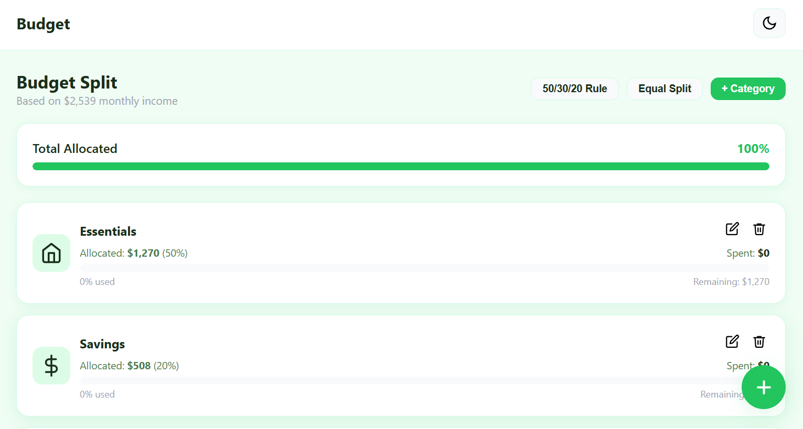
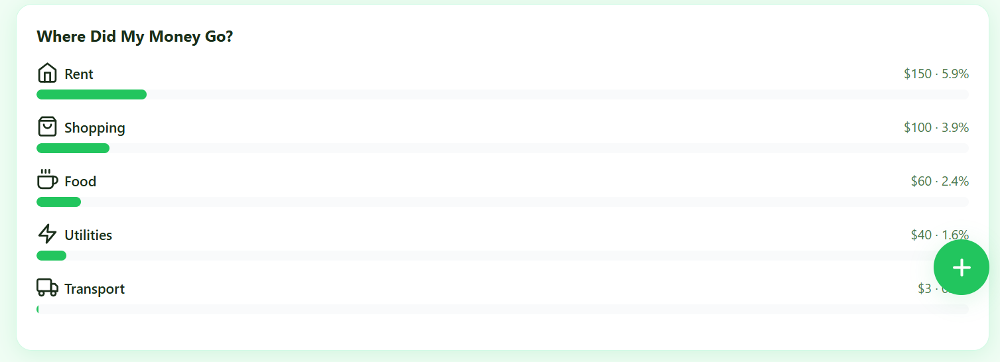
- Automatic salary distribution
- Custom percentage allocation
- Budget categories:
  - Essentials
  - Savings
  - Investments
  - Entertainment
  - Emergency Fund

###  Expense Tracking
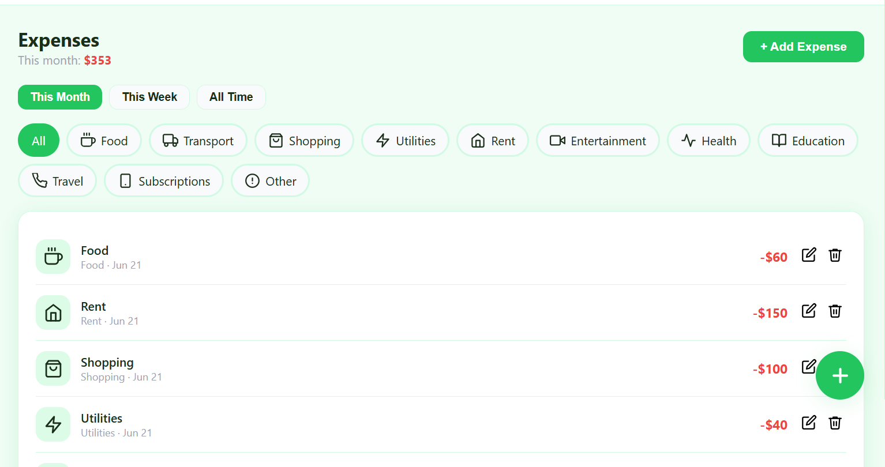
- Quick expense entry
- Custom expense categories
- Weekly and monthly spending summaries
- Detailed spending breakdowns

###  Financial Goals
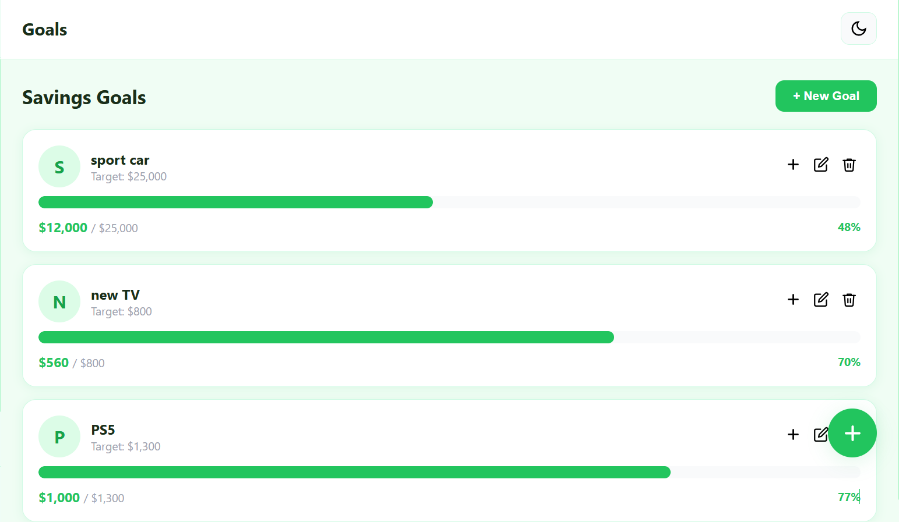
- Create personalized savings goals
- Visual progress tracking
- Monthly savings recommendations

###  Smart Insights
- Spending analysis
- Overspending alerts
- Personalized saving suggestions

###  Savings Vaults
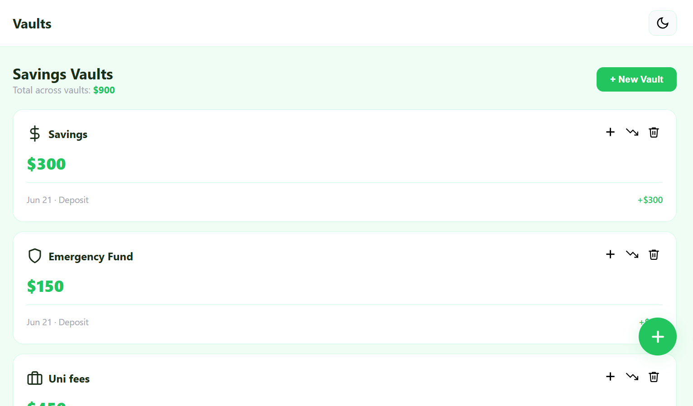

- Create dedicated savings pockets
- Emergency Fund
- Travel Fund
- Personal Savings

###  Piggy Bank
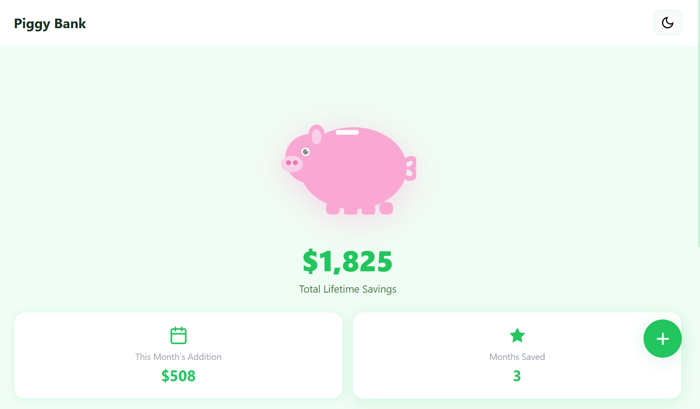
- Automatically accumulates monthly savings
- Tracks total saved money
- 
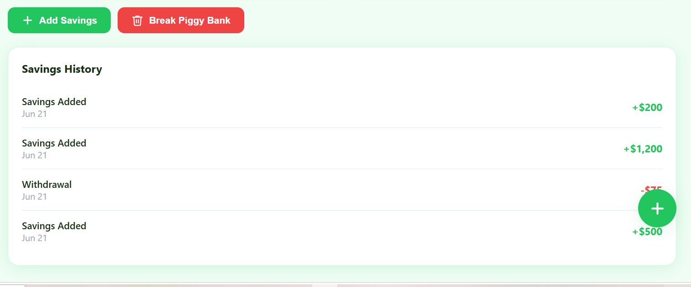

- Displays savings history
- Visual growth progress
- Optional saving streaks

###  Calendar
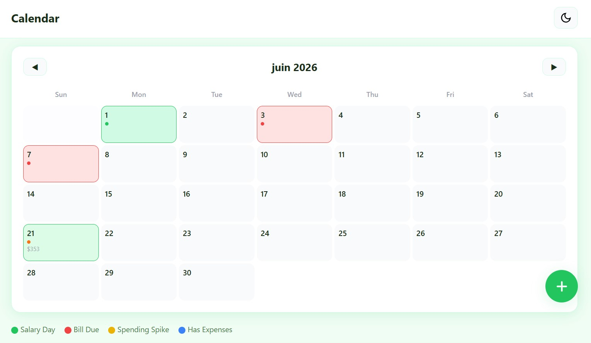
- Salary payment dates
- Bill due dates
- Spending activity overview

###  Notifications
- Salary reminders
- Bill payment alerts
- Budget warnings
- Savings progress updates

###  Analytics Dashboard
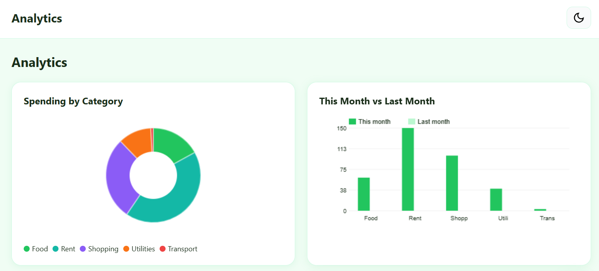
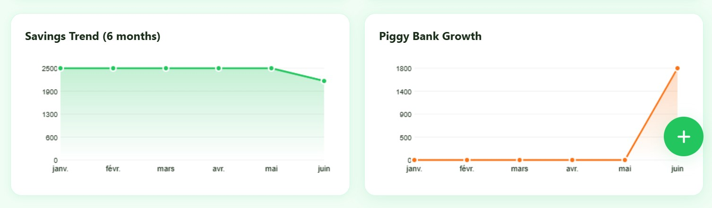
- Spending distribution charts
- Monthly comparisons
- Savings growth trends
- Piggy Bank growth analytics

###  Security
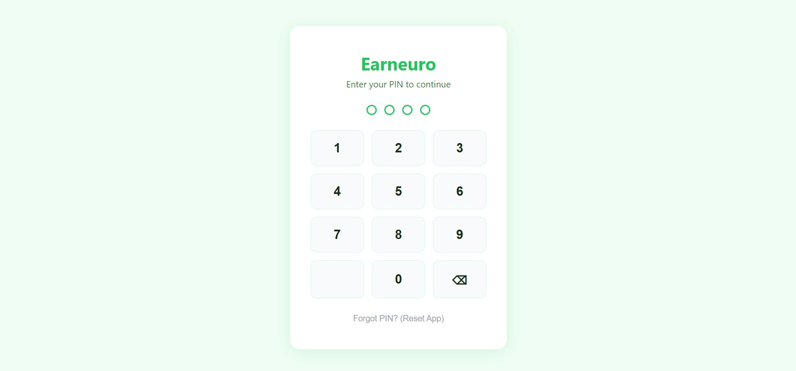
- PIN protection
- Biometric authentication support
- Secure local storage
- Offline access
###  Darkmode
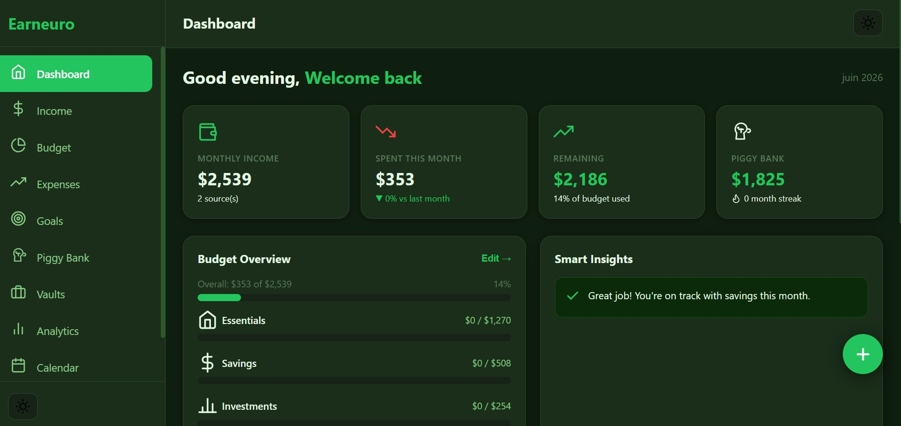
##  Vision

Earneuro is built to make personal finance simple, accessible, and motivating. By combining budgeting tools, savings systems, and visual analytics, users can make smarter financial decisions and reach their goals faster.

##  Mission

Help people gain control over their finances, develop strong saving habits, and build a more secure financial future.

